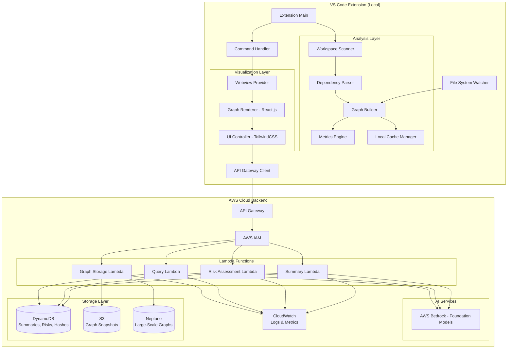

# Design Document: CodeChronicle

## Overview

CodeChronicle is a VS Code extension that combines deterministic static analysis with AWS cloud-powered AI reasoning to help developers understand and safely modify legacy codebases. The architecture follows a clear separation of concerns: deterministic logic handles file scanning, dependency detection, and graph construction locally, while AWS cloud services provide semantic understanding, risk assessment, and natural language interaction.

The extension consists of four main layers:
1. **Analysis Layer** (Local): Scans the workspace, parses dependencies, and constructs the code graph
2. **Cloud Backend Layer** (AWS): Lambda functions orchestrate AI requests via API Gateway
3. **AI Layer** (AWS Bedrock): Foundation models provide summaries, risk analysis, and Q&A
4. **Visualization Layer** (Local): React.js + TailwindCSS webview renders interactive graphs

## Tech Stack

- **Cloud Platform**: AWS Cloud
- **Database/Storage**: 
  - Amazon DynamoDB for AI summaries, risk scores, and file hashes
  - Amazon S3 for graph snapshots and analysis artifacts
  - Amazon Neptune for large-scale graph storage and traversal (10,000+ files)
- **Frontend**: VS Code Extension API, Webview API, React.js, TailwindCSS
- **AI/ML**: Amazon Bedrock (Foundation Models)
- **Backend/Orchestration**: AWS Lambda, API Gateway
- **Authentication**: AWS IAM for role-based access control
- **Monitoring**: Amazon CloudWatch for logs, metrics, and cost control

## Architecture

### High-Level Architecture



### Component Responsibilities

**Extension Main**
- Activates the extension when VS Code starts or when a relevant command is invoked
- Registers commands, file watchers, and webview providers
- Manages extension lifecycle and cleanup
- Initializes API Gateway client with IAM credentials

**Workspace Scanner**
- Discovers all source files in the workspace
- Respects .gitignore patterns and configured exclusions
- Returns a list of file paths for analysis

**Dependency Parser**
- Extracts import/require statements from source files using regex
- Supports multiple languages (JavaScript, TypeScript, Python, Java, etc.)
- Resolves relative imports to absolute workspace paths

**Graph Builder**
- Constructs a directed graph from parsed dependencies
- Maintains nodes (files) and edges (dependencies)
- Provides graph traversal methods for blast radius computation
- Switches to Neptune for large-scale graphs (10,000+ files)

**Metrics Engine**
- Computes structural metrics: dependency count, dependent count, lines of code
- Calculates centrality scores using graph algorithms
- Provides deterministic complexity measures

**Local Cache Manager**
- Maintains in-memory graph during extension session
- Provides fast local access to frequently used data
- Syncs with cloud storage (S3, DynamoDB) as needed

**API Gateway Client**
- Manages authentication with AWS IAM
- Handles HTTP requests to API Gateway endpoints
- Implements retry logic and exponential backoff
- Monitors rate limits and queues requests

**Lambda Functions**
- **Summary Lambda**: Generates file summaries using Bedrock, stores in DynamoDB
- **Risk Lambda**: Assesses file risk using Bedrock, stores in DynamoDB
- **Query Lambda**: Processes natural language queries using Bedrock
- **Graph Lambda**: Manages graph snapshots in S3 and Neptune operations

**AWS Bedrock**
- Provides foundation models for semantic analysis
- Processes prompts for summaries, risk assessment, and Q&A
- Returns structured responses to Lambda functions

**DynamoDB**
- Stores AI-generated summaries with file hashes as keys
- Stores risk assessments with file hashes
- Enables fast cache lookups to avoid redundant AI calls
- Supports TTL for automatic cache expiration

**S3**
- Stores graph snapshots for persistence
- Stores analysis artifacts and historical data
- Provides versioning for graph evolution tracking

**Neptune**
- Handles large-scale graph storage (10,000+ files)
- Provides efficient graph traversal for blast radius queries
- Supports Gremlin queries for complex graph operations

**CloudWatch**
- Logs Lambda execution details and errors
- Tracks metrics: API call counts, latency, costs
- Provides alerts for rate limits and failures

**Webview Provider**
- Creates and manages the VS Code webview panel
- Handles communication between extension and webview
- Passes graph data and user interactions

**Graph Renderer (React.js)**
- Renders the code graph using a JavaScript graph library (e.g., Cytoscape.js or vis.js)
- Applies visual encodings: size for complexity, color for risk
- Handles user interactions: clicks, hovers, zoom, pan
- Built with React.js for component-based UI

**UI Controller (TailwindCSS)**
- Manages webview state and user interactions
- Coordinates between graph visualization and side panels
- Handles blast radius mode and query interface
- Styled with TailwindCSS for responsive design

## Components and Interfaces

### Core Data Structures

#### CodeGraph
```typescript
interface CodeGraph {
  nodes: Map<string, GraphNode>;
  edges: GraphEdge[];
  metadata: GraphMetadata;
}

interface GraphNode {
  id: string;                    // Unique file identifier
  path: string;                  // Workspace-relative path
  metrics: StructuralMetrics;
  riskFactor?: RiskFactor;
  summary?: string;
  contentHash: string;           // For cache invalidation
}

interface GraphEdge {
  source: string;                // Source node ID
  target: string;                // Target node ID
  type: DependencyType;          // import, require, include
}

interface GraphMetadata {
  workspacePath: string;
  totalFiles: number;
  lastUpdated: Date;
  version: string;
}
```

#### StructuralMetrics
```typescript
interface StructuralMetrics {
  linesOfCode: number;
  dependencyCount: number;       // Outgoing edges
  dependentCount: number;        // Incoming edges
  centralityScore: number;       // Betweenness centrality
}
```

#### RiskFactor
```typescript
interface RiskFactor {
  level: 'low' | 'medium' | 'high';
  score: number;                 // 0-100
  explanation: string;
  factors: string[];             // e.g., ["database access", "authentication logic"]
}
```

### Analysis Layer Interfaces

#### IWorkspaceScanner
```typescript
interface IWorkspaceScanner {
  scan(workspacePath: string, exclusions: string[]): Promise<string[]>;
}
```

#### IDependencyParser
```typescript
interface IDependencyParser {
  parse(filePath: string, content: string): Dependency[];
  getSupportedExtensions(): string[];
}

interface Dependency {
  importPath: string;
  resolvedPath?: string;
  lineNumber: number;
}
```

#### IGraphBuilder
```typescript
interface IGraphBuilder {
  buildGraph(files: string[], dependencies: Map<string, Dependency[]>): CodeGraph;
  updateNode(nodeId: string, content: string): void;
  removeNode(nodeId: string): void;
  computeBlastRadius(nodeId: string): string[];
  shouldUseNeptune(): boolean;  // Check if graph size exceeds threshold
}
```

#### IMetricsEngine
```typescript
interface IMetricsEngine {
  computeMetrics(graph: CodeGraph): void;
  computeNodeMetrics(node: GraphNode, graph: CodeGraph): StructuralMetrics;
}
```

### Cloud Backend Interfaces

#### IAPIGatewayClient
```typescript
interface IAPIGatewayClient {
  initialize(config: AWSConfig): Promise<void>;
  requestSummary(request: SummaryRequest): Promise<SummaryResponse>;
  requestRiskAssessment(request: RiskRequest): Promise<RiskResponse>;
  processQuery(request: QueryRequest): Promise<QueryResponse>;
  uploadGraphSnapshot(graph: CodeGraph): Promise<string>;  // Returns S3 URL
  checkRateLimit(): boolean;
}

interface AWSConfig {
  apiGatewayEndpoint: string;
  iamCredentials: IAMCredentials;
  region: string;
}

interface IAMCredentials {
  accessKeyId: string;
  secretAccessKey: string;
  sessionToken?: string;
}
```

#### Lambda Function Interfaces

```typescript
// Summary Lambda
interface SummaryRequest {
  fileContent: string;
  filePath: string;
  fileHash: string;
  metrics: StructuralMetrics;
  dependencies: string[];
  dependents: string[];
}

interface SummaryResponse {
  summary: string;
  cached: boolean;
  timestamp: string;
}

// Risk Assessment Lambda
interface RiskRequest {
  fileContent: string;
  filePath: string;
  fileHash: string;
  metrics: StructuralMetrics;
  dependencies: string[];
  dependents: string[];
}

interface RiskResponse {
  riskFactor: RiskFactor;
  cached: boolean;
  timestamp: string;
}

// Query Lambda
interface QueryRequest {
  query: string;
  graphContext: GraphContext;
  maxResults: number;
}

interface QueryResponse {
  answer: string;
  references: FileReference[];
  suggestedQuestions?: string[];
  confidence: number;
}

interface GraphContext {
  totalFiles: number;
  relevantFiles: Array<{
    path: string;
    summary?: string;
    metrics: StructuralMetrics;
  }>;
}
```

#### DynamoDB Schema

```typescript
// Summaries Table
interface SummaryRecord {
  fileHash: string;           // Partition key
  filePath: string;           // Sort key
  summary: string;
  timestamp: string;
  ttl: number;                // Auto-expiration
}

// Risk Assessments Table
interface RiskRecord {
  fileHash: string;           // Partition key
  filePath: string;           // Sort key
  riskFactor: RiskFactor;
  timestamp: string;
  ttl: number;
}
```

#### S3 Storage Structure

```
s3://code-chronicle-{workspace-id}/
  ├── graphs/
  │   ├── snapshot-{timestamp}.json
  │   └── latest.json
  ├── artifacts/
  │   └── analysis-{timestamp}.json
  └── history/
      └── evolution-{date}.json
```

### AI Layer Interfaces

#### AWS Bedrock Integration (Lambda-side)

```typescript
interface IBedrockService {
  initialize(region: string): Promise<void>;
  invokeModel(modelId: string, prompt: string): Promise<string>;
  invokeModelWithRetry(modelId: string, prompt: string, maxRetries: number): Promise<string>;
}

// Used within Lambda functions
const bedrockModels = {
  summary: 'anthropic.claude-v2',
  risk: 'anthropic.claude-v2',
  query: 'anthropic.claude-v2'
};
```

### Visualization Layer Interfaces

#### IWebviewProvider
```typescript
interface IWebviewProvider {
  createWebview(graph: CodeGraph): void;
  updateGraph(graph: CodeGraph): void;
  handleMessage(message: WebviewMessage): void;
}

interface WebviewMessage {
  command: string;
  payload: any;
}
```

#### Message Protocol (Extension ↔ Webview)
```typescript
// Extension → Webview
type ExtensionMessage =
  | { type: 'init', graph: CodeGraph }
  | { type: 'update', graph: CodeGraph }
  | { type: 'highlight', nodeIds: string[] }
  | { type: 'summary', nodeId: string, summary: string, cached: boolean }
  | { type: 'risk', nodeId: string, risk: RiskFactor, cached: boolean }
  | { type: 'queryResult', result: QueryResponse }
  | { type: 'error', message: string, fallbackData?: any }
  | { type: 'cloudStatus', status: 'connected' | 'disconnected' | 'rate-limited' };

// Webview → Extension
type WebviewMessage =
  | { type: 'nodeClick', nodeId: string }
  | { type: 'blastRadius', nodeId: string }
  | { type: 'query', query: string }
  | { type: 'openFile', path: string }
  | { type: 'refresh' }
  | { type: 'toggleCloudMode', enabled: boolean };
```

## Data Models

### File System Representation

The extension works directly with the VS Code workspace file system. Files are identified by their workspace-relative paths, which serve as unique identifiers in the graph.

### Graph Storage

The code graph is stored in multiple formats depending on scale:

1. **In-Memory (Local)**: A `CodeGraph` object maintained during the extension session
2. **S3 (Cloud)**: JSON snapshots stored in S3 for persistence and versioning
3. **Neptune (Cloud)**: Large-scale graphs (10,000+ files) stored in Neptune for efficient traversal

S3 snapshot structure:
```json
{
  "version": "1.0.0",
  "workspacePath": "/path/to/workspace",
  "workspaceId": "abc123",
  "lastUpdated": "2024-01-15T10:30:00Z",
  "fileCount": 1250,
  "storageMode": "s3",  // or "neptune"
  "nodes": {
    "src/index.ts": {
      "id": "src/index.ts",
      "path": "src/index.ts",
      "contentHash": "abc123...",
      "metrics": {
        "linesOfCode": 150,
        "dependencyCount": 5,
        "dependentCount": 2,
        "centralityScore": 0.75
      }
    }
  },
  "edges": [
    {
      "source": "src/index.ts",
      "target": "src/database.ts",
      "type": "import"
    }
  ]
}
```

Neptune graph structure (Gremlin):
```gremlin
// Vertex (File)
g.addV('file')
  .property('id', 'src/index.ts')
  .property('path', 'src/index.ts')
  .property('contentHash', 'abc123...')
  .property('linesOfCode', 150)
  .property('centralityScore', 0.75)

// Edge (Dependency)
g.V().has('id', 'src/index.ts')
  .addE('imports')
  .to(g.V().has('id', 'src/database.ts'))
```

### AI Service Prompts

#### Summary Generation Prompt Template (Bedrock)
```
You are analyzing a source code file in a large codebase.

File: {filePath}
Lines of Code: {linesOfCode}
Dependencies: {dependencyCount}
Dependents: {dependentCount}

File Content:
{fileContent}

Dependency Context:
This file imports: {importedFiles}
This file is imported by: {dependentFiles}

Generate a concise summary (2-3 sentences) explaining:
1. What this file does
2. Why it exists in the codebase
3. Its role in the overall architecture

Return only the summary text, no additional formatting.
```

#### Risk Assessment Prompt Template (Bedrock)
```
You are assessing the risk of modifying a source code file.

File: {filePath}
Structural Metrics:
- Lines of Code: {linesOfCode}
- Number of Dependencies: {dependencyCount}
- Number of Dependents: {dependentCount}
- Centrality Score: {centralityScore}

File Content:
{fileContent}

Analyze this file for semantic risk factors including:
- Business-critical logic
- Side effects (database writes, API calls, file I/O)
- Security-sensitive operations (authentication, authorization, encryption)
- Hidden coupling (global state, singletons, event emitters)

Return a JSON object with:
{
  "level": "low" | "medium" | "high",
  "score": 0-100,
  "explanation": "Brief explanation of the risk",
  "factors": ["factor1", "factor2", ...]
}
```

#### Query Processing Prompt Template (Bedrock)
```
You are answering questions about a codebase.

User Query: {query}

Codebase Context:
Total Files: {totalFiles}
Graph Structure: {graphSummary}

Relevant Files:
{relevantFiles}

Answer the user's question with:
1. A clear, concise answer
2. Specific file references with paths
3. Line numbers if applicable
4. Suggested follow-up questions if helpful

Format your response as JSON:
{
  "answer": "Your answer here",
  "references": [
    {
      "path": "src/file.ts",
      "lineNumbers": [10, 15],
      "snippet": "relevant code snippet"
    }
  ],
  "suggestedQuestions": ["question1", "question2"],
  "confidence": 0.85
}
```

### Dependency Parsing Patterns

The extension uses language-specific regex patterns to extract dependencies:

**JavaScript/TypeScript**
```typescript
const patterns = [
  /import\s+.*\s+from\s+['"](.+)['"]/g,           // ES6 imports
  /import\s+['"](.+)['"]/g,                       // Side-effect imports
  /require\s*\(\s*['"](.+)['"]\s*\)/g,           // CommonJS requires
  /import\s*\(\s*['"](.+)['"]\s*\)/g             // Dynamic imports
];
```

**Python**
```typescript
const patterns = [
  /^import\s+(\S+)/gm,                            // import module
  /^from\s+(\S+)\s+import/gm                      // from module import
];
```

**Java**
```typescript
const patterns = [
  /^import\s+([\w.]+);/gm                         // import statements
];
```

The parser resolves relative imports to absolute workspace paths and filters out external packages (node_modules, site-packages, etc.).

## Error Handling

### Error Categories

1. **File System Errors**: File not found, permission denied, invalid path
2. **Parsing Errors**: Malformed code, unsupported syntax, encoding issues
3. **Cloud Backend Errors**: API Gateway failures, Lambda timeouts, IAM permission issues
4. **AI Service Errors**: Bedrock rate limiting, network failures, invalid responses
5. **Storage Errors**: DynamoDB throttling, S3 upload failures, Neptune connection issues
6. **Graph Errors**: Circular dependencies, orphaned nodes, invalid references

### Error Handling Strategy

**File System Errors**
- Log the error with file path and reason to CloudWatch
- Continue processing remaining files
- Display a notification to the user if critical files fail

**Parsing Errors**
- Log the error with file path and line number to CloudWatch
- Skip the problematic file and continue
- Mark the node as "unparsed" in the graph

**Cloud Backend Errors**
- Implement exponential backoff for API Gateway requests
- Cache and return previous results from DynamoDB if available
- Fall back to local-only mode if cloud is unavailable
- Display user-friendly error messages in the UI
- Log all errors to CloudWatch with request context

**AI Service Errors (Bedrock)**
- Implement exponential backoff for rate limiting in Lambda
- Queue requests when rate limits are exceeded
- Return cached results from DynamoDB if available
- Fall back to structural metrics only
- Log errors to CloudWatch with prompt metadata

**Storage Errors**
- Retry DynamoDB operations with exponential backoff
- Fall back to local cache if DynamoDB is unavailable
- Retry S3 uploads with multipart upload for large graphs
- Switch to S3 mode if Neptune is unavailable
- Log all storage errors to CloudWatch

**Graph Errors**
- Validate graph structure after construction
- Remove orphaned nodes and invalid edges
- Log warnings for circular dependencies to CloudWatch

### Graceful Degradation

The extension is designed to degrade gracefully when cloud services are unavailable:

1. **No AWS Credentials**: Disable cloud features, show only local structural metrics
2. **API Gateway Unavailable**: Use local cache, show cached results, notify user
3. **Rate Limit Exceeded**: Queue requests, show cached results from DynamoDB, notify user
4. **Network Failure**: Continue with deterministic features (local graph, metrics)
5. **Invalid AI Response**: Log error to CloudWatch, show structural data, retry on next request
6. **DynamoDB Throttling**: Use local cache, queue writes, retry with backoff
7. **Neptune Unavailable**: Fall back to S3 graph storage, limit graph size

### CloudWatch Integration

**Metrics Tracked**:
- API Gateway request count and latency
- Lambda invocation count, duration, and errors
- Bedrock API call count and token usage
- DynamoDB read/write capacity and throttling
- S3 upload/download size and duration
- Extension activation count and session duration

**Logs Captured**:
- All Lambda function executions with request/response
- File parsing errors with file paths
- AI service errors with prompt context
- Storage operation failures
- User interactions (anonymized)

**Alarms Configured**:
- Lambda error rate > 5%
- API Gateway 5xx errors > 10 per minute
- DynamoDB throttling events
- Bedrock rate limit exceeded
- Monthly cost exceeds threshold

## Testing Strategy

### Unit Testing

Unit tests will verify individual components in isolation:

- **Workspace Scanner**: Test file discovery with various .gitignore patterns
- **Dependency Parser**: Test regex patterns against sample code snippets
- **Graph Builder**: Test graph construction with known dependency structures
- **Metrics Engine**: Test metric calculations with predefined graphs
- **Cache Manager**: Test serialization, deserialization, and invalidation

### Integration Testing

Integration tests will verify component interactions:

- **End-to-End Graph Construction**: Scan → Parse → Build → Compute Metrics
- **AI Service Integration**: Mock AWS Bedrock responses and verify handling
- **Webview Communication**: Test message passing between extension and webview
- **File Watcher Integration**: Test incremental updates when files change

### Property-Based Testing

Property-based tests will verify universal correctness properties across many generated inputs. Each property test will run a minimum of 100 iterations with randomized inputs.


## Correctness Properties

A property is a characteristic or behavior that should hold true across all valid executions of a system—essentially, a formal statement about what the system should do. Properties serve as the bridge between human-readable specifications and machine-verifiable correctness guarantees.

### Property 1: File Discovery Completeness
*For any* workspace with a set of source files and .gitignore patterns, scanning should discover all files that are not excluded by .gitignore patterns or common dependency directories (node_modules, vendor, .git), and all discovered file paths should be relative to the workspace root.

**Validates: Requirements 1.1, 1.2, 1.4**

### Property 2: Import Extraction Accuracy
*For any* source file containing valid import statements, parsing should extract all import statements using language-specific patterns, and each extracted import should preserve its original import path and line number.

**Validates: Requirements 2.1**

### Property 3: Local vs External Import Classification
*For any* import statement, the parser should correctly classify it as either local (creating an edge in the graph) or external (excluded from the graph), and no external package imports should appear as edges in the code graph.

**Validates: Requirements 2.2, 2.3**

### Property 4: Graph Structure Consistency
*For any* set of parsed files and dependencies, the constructed code graph should have exactly one node per file, and each dependency relationship should correspond to exactly one edge from the importing file to the imported file.

**Validates: Requirements 2.4**

### Property 5: Error Resilience in Parsing
*For any* set of files where some files have parsing errors, the extension should log errors for unparseable files and successfully process all remaining parseable files, resulting in a partial graph that includes all successfully parsed files.

**Validates: Requirements 2.5, 11.3**

### Property 6: Comprehensive Metrics Computation
*For any* node in the code graph, the extension should compute and store all structural metrics (incoming edge count, outgoing edge count, lines of code, centrality score) as node metadata, and these metrics should be accessible for all nodes.

**Validates: Requirements 3.1, 3.2, 3.3, 3.4, 3.5**

### Property 7: AI Request Context Completeness
*For any* AI service request (summary, risk assessment, or query), the request should include all necessary context: file contents, structural metrics, and relevant graph information (dependencies and dependents).

**Validates: Requirements 4.2, 6.2, 8.1**

### Property 8: Risk Factor Extraction
*For any* valid AI service response containing risk analysis, the extension should successfully extract both the risk level (low, medium, high) and a human-readable explanation.

**Validates: Requirements 4.3, 4.4**

### Property 9: Visual Encoding Consistency
*For any* node rendered in the webview, the node size should be proportional to its complexity score, and the node color should correspond to its risk level (green for low, yellow for medium, red for high).

**Validates: Requirements 5.3, 5.4**

### Property 10: Blast Radius Completeness
*For any* node in the code graph, computing the blast radius should return all nodes that transitively depend on the selected node, including both direct and indirect dependents.

**Validates: Requirements 7.1, 7.2**

### Property 11: Blast Radius Round Trip
*For any* visualization state, activating blast radius mode and then deactivating it should restore the original visualization state with no nodes remaining highlighted.

**Validates: Requirements 7.5**

### Property 12: Query Response Structure
*For any* natural language query that AI service can answer, the response should include a textual answer and file-level references, and all referenced files should be highlighted in the webview.

**Validates: Requirements 8.2, 8.3**

### Property 13: Graph Serialization Round Trip
*For any* code graph, serializing it to a cache file and then deserializing it should produce an equivalent graph with the same nodes, edges, and metadata.

**Validates: Requirements 9.1, 9.3**

### Property 14: Cache Invalidation on Content Change
*For any* file with cached AI analysis, modifying the file content should invalidate the cached analysis, and subsequent requests should trigger new AI service calls rather than returning stale cached data.

**Validates: Requirements 9.4, 10.4**

### Property 15: Summary Caching Effectiveness
*For any* file that has been summarized, requesting the summary again without modifying the file should return the cached result without making a new AI service call.

**Validates: Requirements 6.4, 9.2**

### Property 16: Incremental Node Addition
*For any* code graph and any new file created in the workspace, the extension should add a new node to the graph with correct dependencies, and the webview should reflect the updated graph.

**Validates: Requirements 10.1, 10.5**

### Property 17: Incremental Node Removal
*For any* code graph and any file deleted from the workspace, the extension should remove the corresponding node and all edges connected to that node (both incoming and outgoing), and the webview should reflect the updated graph.

**Validates: Requirements 10.2, 10.5**

### Property 18: Incremental Dependency Update
*For any* file in the graph, modifying its import statements should result in the graph edges being updated to reflect the new dependencies, with old edges removed and new edges added as appropriate.

**Validates: Requirements 10.3**

### Property 19: AI Service Fallback Behavior
*For any* AI service call that fails, the extension should return cached results if available, or fall back to displaying structural metrics only, and should never crash or leave the UI in an inconsistent state.

**Validates: Requirements 4.5, 11.2**

### Property 20: Status Bar State Accuracy
*For any* extension state (scanning, ready, error), the status bar item should display the current state, and state transitions should be reflected in the status bar within 1 second.

**Validates: Requirements 12.4**

### Property 21: Configuration Exclusion Patterns
*For any* configured file exclusion patterns, scanning the workspace should exclude all files matching those patterns, and no excluded files should appear as nodes in the code graph.

**Validates: Requirements 13.1**

### Property 22: Configuration File Limit
*For any* configured maximum file limit, the extension should analyze at most that many files, and should not exceed the limit even if more files exist in the workspace.

**Validates: Requirements 13.4**
